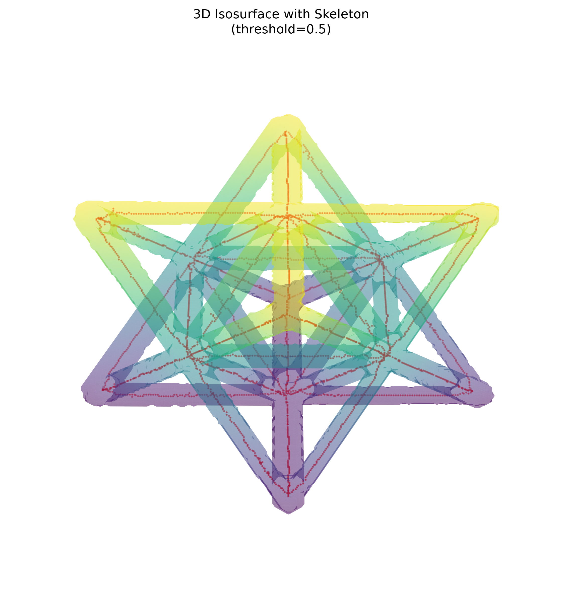
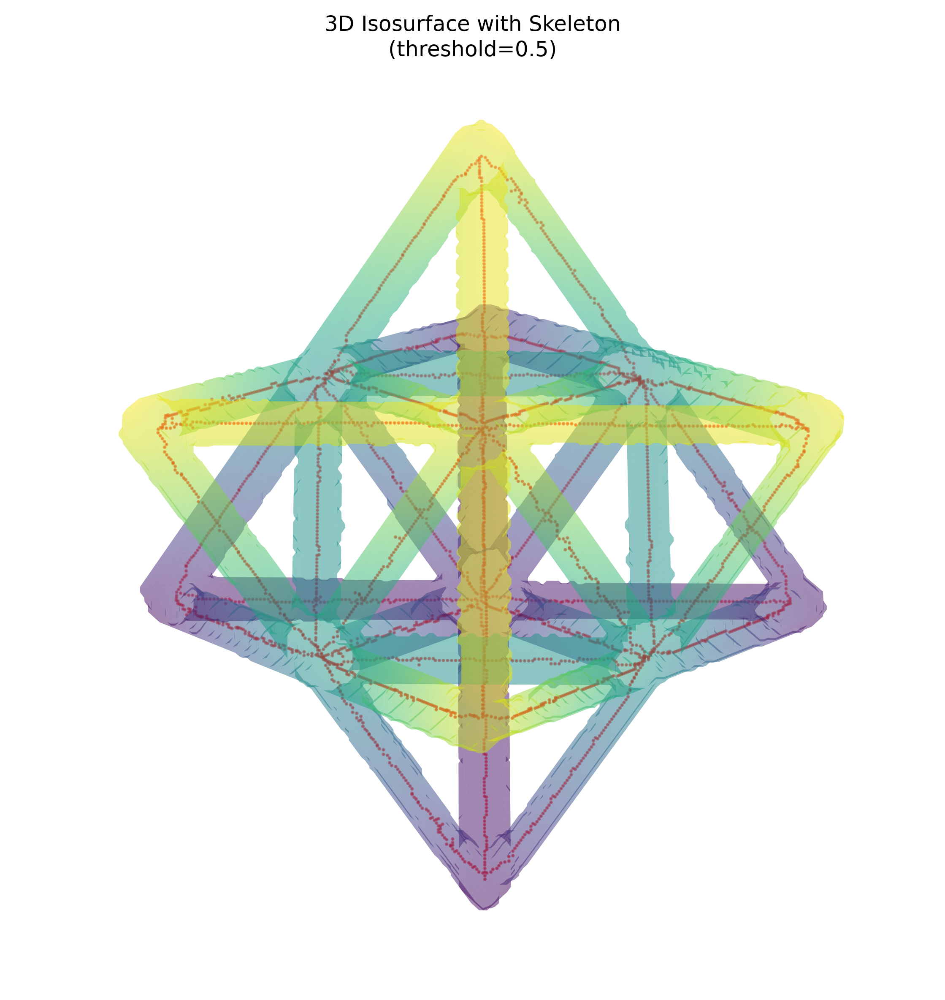

# NDE Report — Octet Truss Unit Cell

## Dataset

This report evaluates the matching volume, segmentation, and skeleton arrays in `data/unitcell/` for the *octet_truss_unit_cell_no_defects_0256_xray_recon* dataset.

## Summary metrics

| Source | Metric | Result |
|---|---|---:|
| Raw volume | Array shape / type | 256 × 256 × 256 / `float32` |
| Raw volume | Intensity range | −0.003129 to 0.015258 |
| Raw volume | Global mean intensity | 0.000539 |
| Segmentation mask | ROI volume | 721,774 voxels |
| Segmentation mask | Occupied volume fraction | 4.302% |
| Segmentation mask | Mean intensity within ROI | 0.011661 |
| Segmentation mask | Mean background intensity | 0.000039 |
| Skeleton | Skeleton length proxy | 3,173 voxels |
| Skeleton | Connected components | 1 |
| Skeleton | Endpoints | 47 |
| Skeleton | Branch-point voxels / clustered branch regions | 168 / 62 |
| Alignment | Skeleton voxels within mask | 100.0% |

All arrays have the same 256 × 256 × 256 shape. Branch-point values use a 26-neighbourhood: skeleton voxels with at least three neighbouring skeleton voxels are classified as branch voxels; contiguous branch voxels are grouped into regions.

## 3D visual gallery

The mask is rendered as a semi-transparent isosurface with the skeleton overlaid in red. Rendering used a factor-of-two spatial downsample and a normalized isosurface threshold of 0.5.

### View A — elevation 30°, azimuth 45°

### View B — elevation 60°, azimuth 45°

## Interpretation

The segmentation isolates a sparse lattice volume (4.302% of the reconstruction) whose mean intensity is substantially higher than the background, indicating strong contrast between the reconstructed struts and surrounding voxels. The skeleton forms one connected network and is fully contained in the mask, supporting good mask-to-structure alignment. The two views show the expected interconnected octet-truss geometry; the endpoint count is consistent with skeleton terminations at the cropped unit-cell boundaries rather than evidence of a disconnected internal feature.
