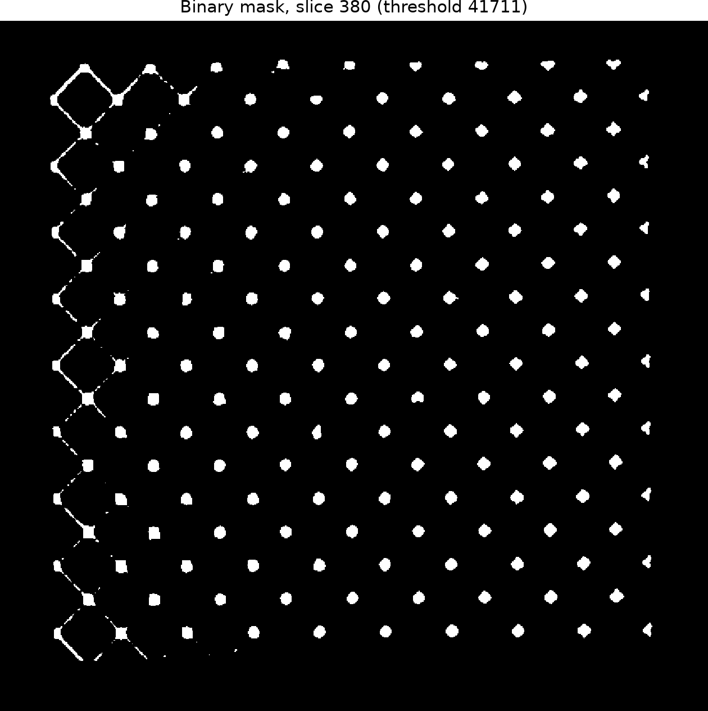

# 9x9x9 Octet Lattice Segmentation Report

## Result

The `9x9x9_octet_lattice.tif` CT stack was segmented into a binary, shape-preserving
mask. The source volume has shape `761 × 815 × 837` (519,119,955 voxels) and
`uint16` intensities spanning 0–65,535.

The accepted threshold is **41,711**, the measured **90th percentile (p90)** of
the raw-volume intensity distribution. This data-derived level produced a sparse,
periodic lattice pattern on slice 380 that closely follows the supplied reference
segmentation, while retaining a plausible foreground fraction.

| Metric | Value |
|---|---:|
| Final threshold | 41,711 (p90) |
| Foreground voxels | 51,913,338 |
| Background voxels | 467,206,617 |
| Foreground fraction | 10.000259% |
| Total voxels | 519,119,955 |

## Iterative optimization

Two sequential candidate evaluations were needed. The first, p75 = 33,686,
selected 129,808,871 voxels (25.005564%) and produced visibly over-thick,
over-connected struts on the reference slice; it was rejected for over-segmentation.
The threshold was increased to p90 = 41,711, reducing the foreground to
51,913,338 voxels (10.000259%) and yielding discrete periodic nodes and the
left-edge lattice structure consistent with the supplied slice-380 reference.
It passed the non-degeneracy and 0.1–50% foreground-fraction criteria, so the
optimization stopped. A p95 screen (48,037; 5.000007%) was also inspected and
was more restrictive, with visibly thinner/fragmented struts, supporting p90 as
the conservative final choice.

## Validation

- The output is a 3D binary TIFF with the same `761 × 815 × 837` shape as the
  source stack.
- The mask contains both foreground and background; it is neither empty nor full.
- The selected 10.000259% foreground fraction is within the required plausible
  range for a sparse lattice.
- Slice 380 visually shows the expected periodic lattice-like pattern rather than
  isolated noise. It qualitatively aligns with
  `../ground_truth_segmentation_slice_380.png`; p75 was too inclusive and p95
  removed visible strut detail.

## Final mask visualization

