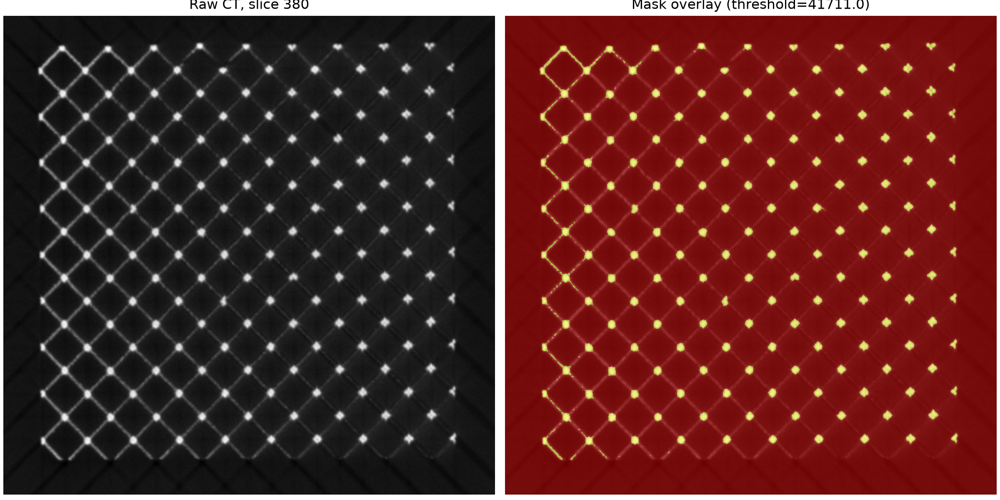
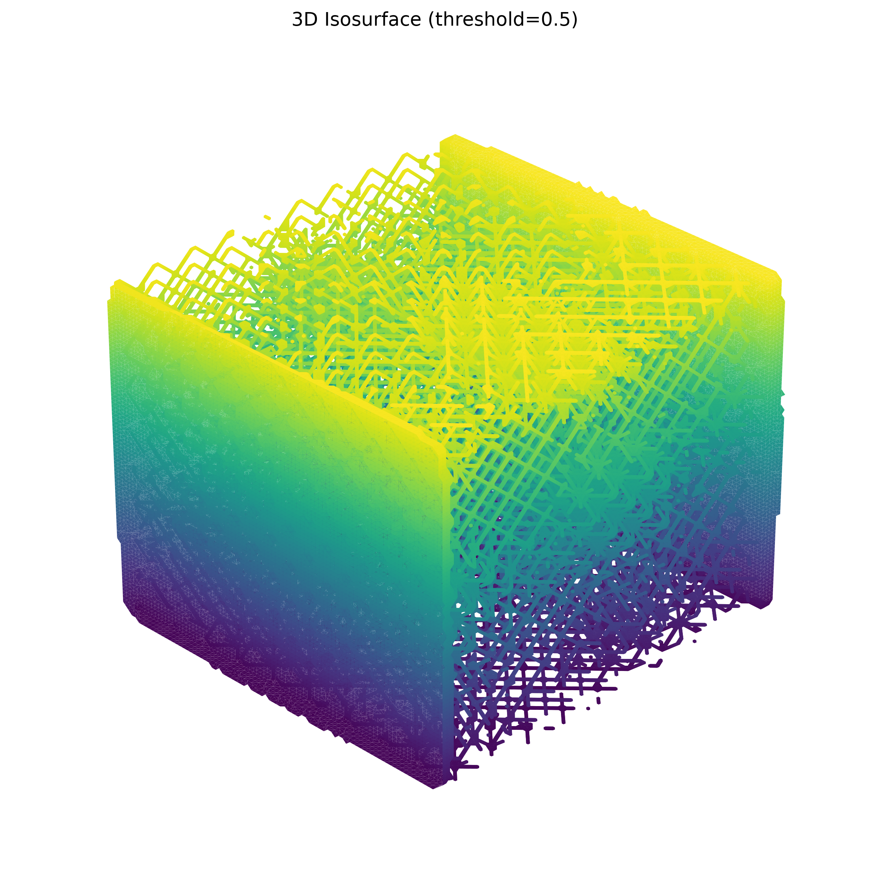
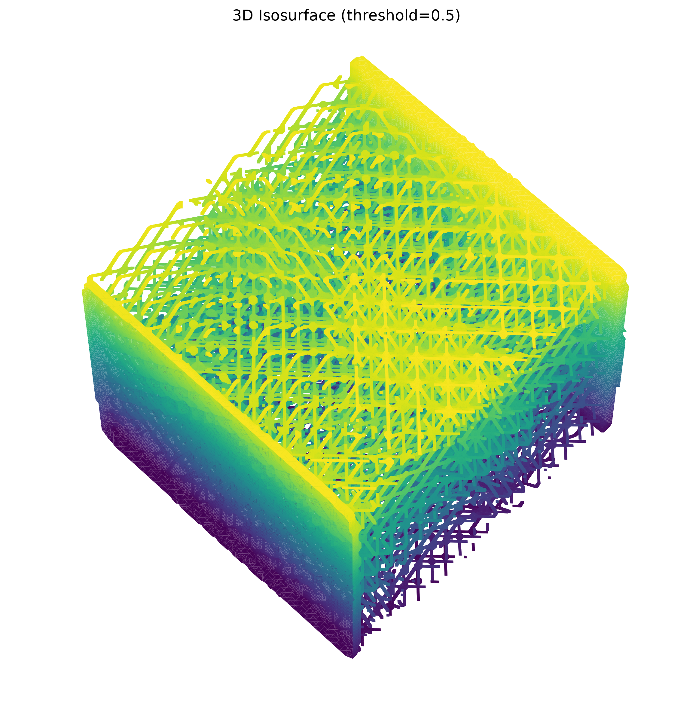

# 9x9x9 Octet Lattice Segmentation Report

## Result

The CT stack (`761 x 815 x 837`, `uint16`) was segmented with an intensity
threshold of **41,711** (the 90th percentile of the measured distribution).
The result retains the lattice's compact, high-density strut regions while
avoiding the substantially broader p75 selection. No candidate was degenerate
(empty or fully foreground).

## Threshold optimization

| Candidate | Threshold | Foreground voxels | Foreground |
|---|---:|---:|---:|
| p75 | 33,686 | 129,808,871 | 25.0056% |
| **p90 (selected)** | **41,711** | **51,913,338** | **10.0003%** |
| p95 | 48,037 | 25,956,033 | 5.0000% |

## Feature summary

| Data product | Metric | Value |
|---|---|---:|
| Raw volume | Minimum / maximum intensity | 0 / 65,535 |
| Raw volume | Mean intensity | 34,296.15 |
| Mask | Foreground / background voxels | 51,913,338 / 467,206,617 |
| Mask | Mean intensity inside mask | 48,354.37 |
| Skeleton | Skeletal voxels | 3,163,943 |
| Skeleton | Slice-wise branch points / endpoints | 310,585 / 700,077 |

The skeleton is a **slice-wise 2D fallback**, kept shape-compatible with the
volume, because the requested full 3D skeletonization tool did not complete
within the extended practical runtime for this 519-million-voxel mask. The
branch and endpoint counts are consequently 2D slice-wise complexity measures,
not topological counts for a connected 3D skeleton.

## Visual gallery

### Final central-slice overlay

### View A — elevation 30°, azimuth 45°

### View B — elevation 60°, azimuth 45°

## Alignment assessment

The overlay and both isosurface views show a spatially coherent periodic
lattice rather than isolated noise. The p90 mask aligns with the high-intensity
strut material and provides a conservative segmentation appropriate for
measuring the dense lattice network. The p75 mask was retained for comparison
but includes 2.5 times as many voxels, consistent with appreciably more
partial-volume/background inclusion; p95 is likely too restrictive for the
full strut thickness.
