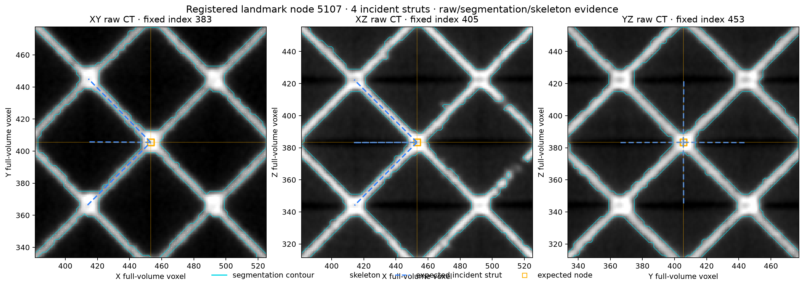
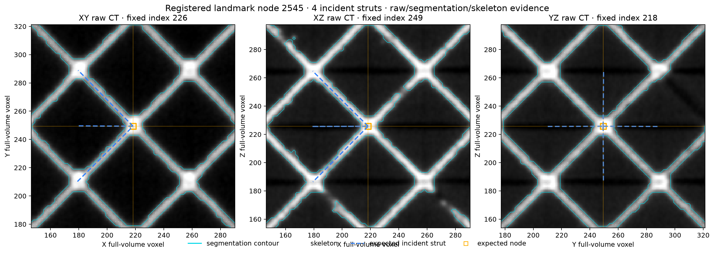
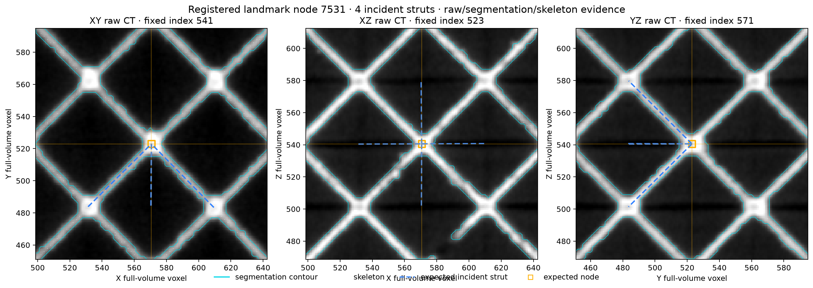
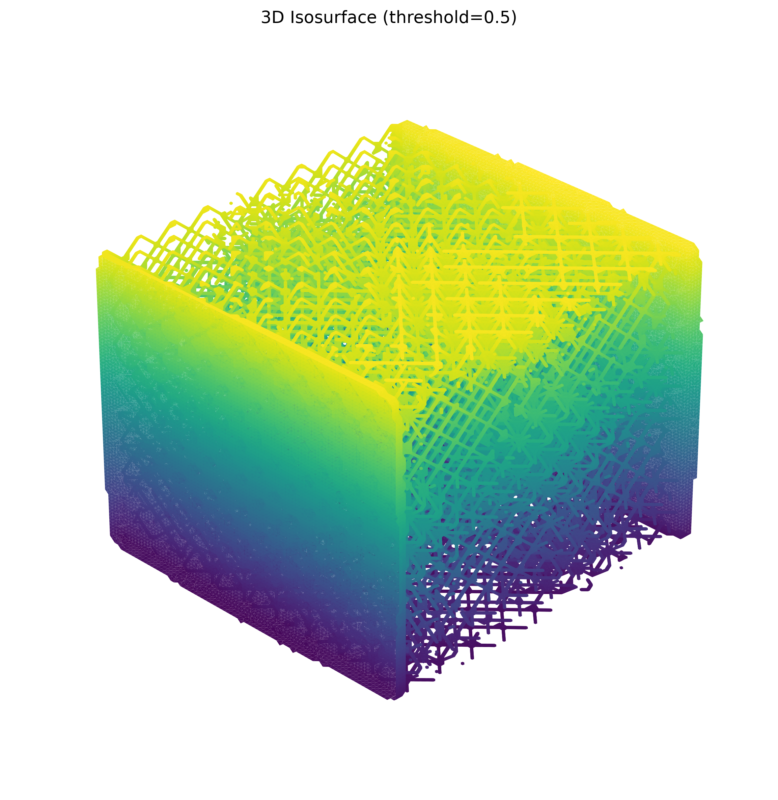
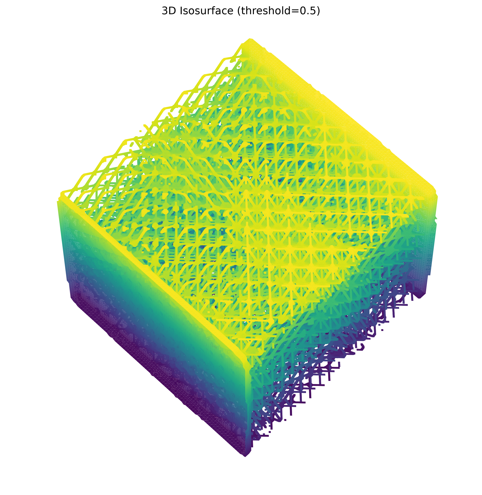

# Strut and Node CT Validation

Status: Phase 1 repository, coordinate, and registration assessment complete  
Assessment date: 2026-07-28  
Automatic candidate validation implemented: no  
Scientific detector behavior changed in Phase 1: no

## Phase 1 outcome

The working application is a standalone Dash/Plotly 3D defect viewer backed by
the deterministic Python pipeline in `src/lattice_pipeline`. The Next.js and
FastAPI applications are currently scaffolds; FastAPI exposes only `/health`,
and Next.js contains no lattice viewer or API client.

The registered TIFF/JSON pair is confirmed by matching specimen basenames.
TIFF metadata explicitly reports a `uint16` volume with shape
`(761, 815, 837)` and axes `ZYX`. JSON node positions are consumed by the
active code as `XYZ` original-volume voxel coordinates. The JSON itself does
not declare coordinate units, axis order, physical spacing, origin, or
registration provenance.

The current registration assessment is `likely_valid`, not `verified`.
Pairing, array axes, volume bounds, path-to-material support, and
path-to-skeleton distances pass the documented numerical gates. Verification
is withheld because the graph does not independently declare its transform or
units, TIFF physical spacing is absent, and the active residual refinement is
fit to the thresholded skeleton later used by the detector.

The selected 3D element remains a candidate. No current path computes a
candidate-level validation status from raw CT evidence.

## Current 3D defect-selection flow

```text
registered JSON junctions/struts
        |
        | identity registered-voxel assumption
        | divide by analysis stride 2
        | segmentation-dependent affine refinement
        v
classify_defects(mask, skeleton, distance map)
        |
        v
analysis.json nodes, struts, defects
        |
        v
Plotly strut/node traces
        |
        | customdata = [element kind, actual graph ID, detector status, ...]
        v
viewer.clickData
        |
        v
app.app._clicked_element()
        |
        +--> highlight selected expected graph element
        +--> show detector details
```

Selection uses the actual graph strut or node ID. It does not infer identity
from color or screen coordinates. However, selection is local to the Dash
callback. There is no persistent selected-element store, shareable URL,
candidate navigation, camera focus, FastAPI validation request, raw slice
request, or linked 2D evidence panel.

## Data pairing and coordinate mapping

| Item | Current convention | Evidence | Assessment |
| --- | --- | --- | --- |
| Raw TIFF | `volume[z, y, x]` | TIFF axes tag is `ZYX` | Confirmed |
| TIFF shape | `(761, 815, 837)` | TIFF series metadata | Confirmed |
| JSON positions | `[x, y, z]` | Loader and graph fields | Confirmed as code convention |
| JSON units | Not declared | No JSON metadata fields | Unknown |
| Registered JSON to CT | Identity in original voxel coordinates | Dataset configuration | Likely valid, not independently verified |
| Analysis arrays | `raw[::2, ::2, ::2]` | Cache pipeline | Confirmed |
| Scientific crop | None | Dataset configuration | Confirmed absent |
| Display crop | Foreground bounding box | Marching-cubes display path | Confirmed |
| Physical spacing | 57.738 µm isotropic estimate | Nominal 9 × 4.56 mm span | Unverified estimate |
| CT origin | Assumed zero | No TIFF origin metadata | Unverified |
| Axis directions | Positive XYZ | Active code | Not independently declared |
| Excluded cut region | No explicit mask or bounds | High-Y face heuristic only | Missing |

Correct raw orthogonal slices are:

```python
xy = volume[z, :, :]  # horizontal X, vertical Y
xz = volume[:, y, :]  # horizontal X, vertical Z
yz = volume[:, :, x]  # horizontal Y, vertical Z
```

Phase 1 adds `src/lattice_pipeline/coordinates.py`. Its
`CoordinateTransform` records:

- axis permutation;
- axis directions/flips;
- JSON-to-physical scale;
- physical translation;
- CT voxel spacing;
- CT physical origin;
- crop offset in ZYX;
- physical units;
- registration status and transform ID.

Full-volume coordinates are the default. A crop offset is subtracted only when
the caller explicitly requests cropped array coordinates. The working detector
has not yet been migrated to this object, so there is no scientific behavior
change in Phase 1.

The active detector also applies a small residual affine fit at analysis
resolution. The reproducible audit serializes this matrix and converts its
translation back to original-volume voxels. This refinement must remain
separate from independent registration evidence because it depends on the
chosen segmentation and skeleton.

## Numerical registration assessment

The current Otsu-based cache uses:

| Measurement | Current result |
| --- | ---: |
| Threshold | 40,127 native `uint16` units |
| Foreground fraction at stride 2 | 0.11293 |
| Expected-path samples | 166,212 |
| Exact centerline foreground fraction | 0.95765 |
| Material within 4 original voxels | 0.97453 |
| Median refined path-to-skeleton distance | 1.365 original voxels |
| P90 refined path-to-skeleton distance | 2.461 original voxels |
| Refinement median before / after | 3.291 / 1.340 original voxels |
| Refinement P90 before / after | 6.729 / 2.398 original voxels |

Graph and volume bounds are:

| Bounds | Minimum XYZ | Maximum XYZ |
| --- | --- | --- |
| CT index bounds | `[0, 0, 0]` | `[836, 814, 760]` |
| Registered JSON | `[58.761, 48.569, 24.495]` | `[773.745, 764.939, 737.846]` |
| Segmented foreground | `[18, 24, 0]` | `[782, 766, 760]` |

The deterministic registration gate returns:

- `registration_failed` for pairing, axis, or bounds failure; degenerate
  foreground fraction; or less than 50% expected-path material support;
- `registration_warning` when path support is below 80%, median
  path-to-skeleton distance exceeds 3 original voxels, or P90 exceeds 8;
- `verified` only when measured gates pass and coordinate, unit, and transform
  provenance are declared;
- `likely_valid` when measured gates pass but provenance is incomplete.

Automatic missing validation must be disabled when this status is
`registration_failed`. The gate is computed and exported in Phase 1, but it is
not yet wired into an API because validation endpoints do not exist.

## Visual registration evidence

The orthogonal landmark overlays use full-resolution raw CT, a stride-2
segmentation contour, the stride-2 skeleton, and refined expected graph
geometry. Three healthy interior locations were checked: lower node 2545,
central node 5107, and upper node 7531. Each has four incident expected
struts. Image origin is explicitly `lower`.



| Lower interior node 2545 | Upper interior node 7531 |
| --- | --- |
|  |  |

The NDE report skill supplied the required fixed 3D segmentation perspectives.
These context images make the high-Y cut surface visually apparent; they are
not used to classify a defect.

| Elevation 30°, azimuth 45° | Elevation 60°, azimuth 45° |
| --- | --- |
|  |  |

The reproducible audit also verifies raw/mask/skeleton shape compatibility and
exports sampled raw intensity, mask voxel count, skeleton voxel count,
connected-component count, and branch-point signal count.

## Current detector inputs and limitations

The detector receives:

- the stride-2 segmentation mask;
- the stride-2 CT-derived skeleton;
- a stride-2 Euclidean distance transform;
- expected nodes and struts transformed into analysis-voxel XYZ;
- the configured estimated voxel size;
- rule thresholds from `DefectConfig`.

For a strut, it samples the trimmed expected centerline, checks the exact mask
voxel and distance to the nearest skeleton, estimates thickness from the EDT
near skeleton voxels, and applies rule thresholds. For a node, it checks the
rounded mask voxel and a skeleton neighborhood. Skeleton components use
26-neighbor connectivity.

This does not yet satisfy candidate validation because it lacks:

- disk/tube occupancy at each path position;
- complete consecutive-gap detection and physical gap length;
- start-node and end-node connection measurements;
- skeleton path continuity between expected node neighborhoods;
- full-resolution final measurements;
- local threshold sensitivity;
- explicit cut-region overlap and boundary distance;
- raw CT, segmentation, skeleton, and graph evidence assets per candidate;
- longitudinal oblique resampling;
- movable perpendicular cross-sections;
- separate detector classification and validation status;
- deterministic evidence explanation;
- manual review and export.

The active cache contains candidate labels, not confirmed defects:

| Element | Candidate counts |
| --- | --- |
| Struts | 16,170 healthy; 1,853 thick; 93 missing; 330 uncertain; 22 broken / disconnected |
| Nodes | 9,979 healthy; 217 uncertain; 8 missing; 2 broken / disconnected |

The CAD-derived intentional-removal comparison treats both missing and broken /
disconnected detector labels as positive predictions. The combined strut/node
metrics are approximately 0.784 precision, 0.860 recall, and 0.820 F1 (98 true
positives, 27 false positives, and 16 false negatives). The paired CAD models
identify intentional removals but do not provide independent IDs for scan-induced
disconnections, so unmatched disconnected predictions count as false positives.
This aggregate ID comparison is useful detector evaluation, but it does not prove
raw CT support for an individual candidate.

Accuracy uses `(TP + TN) / (TP + TN + FP + FN)`.

## Scientific risks

1. Physical voxel spacing and anisotropy are not available from the TIFF.
   Thickness in microns is therefore an estimate and cannot support a final
   thin/thick validation result.
2. The registered JSON contains no transform provenance. Filename pairing and
   measured alignment support `likely_valid`, not `verified`.
3. Registration refinement uses the same threshold-derived skeleton later used
   for detection, so it is not independent evidence.
4. The high-Y cut/absent region is represented only by a face-level heuristic.
   It needs an explicit valid-region or exclusion mask and safety buffer.
5. Detection at stride 2 can hide short gaps and bias thickness. Final
   candidate measurements must use full resolution.
6. Exact-centerline mask sampling is sensitive to residual offset and does not
   measure cross-sectional occupancy.
7. Skeleton absence can reflect skeletonization failure rather than missing
   material.
8. Non-healthy elements expose an uncalibrated `rule_strength` decision-margin
   score, while healthy elements leave it null. It must not be presented as a
   validated probability.

## Proposed validation architecture

```text
3D viewer / candidate table / URL
        |
        | selected graph kind + ID
        v
FastAPI validation route
        |
        v
Analysis registry and cached source assets
        |
        +--> canonical CoordinateTransform
        +--> registered graph lookup
        +--> full-resolution local CT ROI
        +--> local threshold masks
        +--> cached full-resolution mask / EDT / skeleton where available
        +--> explicit valid-region and excluded-region model
        |
        v
Deterministic strut or node evidence service
        |
        +--> tube/disk occupancy and consecutive gaps
        +--> diameter profile
        +--> 26-connected skeleton path support
        +--> endpoint/node connectivity
        +--> threshold stability
        +--> boundary and registration gates
        +--> orthogonal, longitudinal, and cross-sectional assets
        |
        v
Typed validation result
        |
        +--> original detector_classification (immutable)
        +--> validation_status
        +--> traceable evidence and warnings
        +--> deterministic explanation
        +--> optional separate manual review
        |
        v
Linked Next.js validation panel
```

Only compact selected-item arrays or image assets should cross the API. Full CT
volumes remain server-side.

## Files created or modified in Phase 1

- Added `src/lattice_pipeline/coordinates.py`.
- Updated `src/lattice_pipeline/__init__.py`.
- Added `tests/test_coordinates.py`.
- Added `scripts/phase1_registration_audit.py`.
- Added this document.
- Updated `outputs/verification/verification_summary.json`.
- Added five registration visualization assets under `outputs/verification/`.

The existing 3D viewer, segmentation, skeletonization, detector rules, cache
format, and FastAPI/Next.js scaffolds are preserved.

## Implementation phases

### Phase 1 — complete

- inspect repository and active application paths;
- trace selected strut/node IDs and defect records;
- confirm TIFF/JSON pairing;
- establish array and graph coordinate conventions;
- add an explicit canonical coordinate object;
- measure and visualize registration quality;
- document detector inputs, risks, and remaining assumptions.

### Phase 2 — deterministic validation services

- implement full-resolution local ROI loading;
- implement strut centerline/tube sampling and node neighborhoods;
- measure occupancy, gaps, endpoint connectivity, and thickness;
- compare expected paths with skeleton evidence using 26-connectivity;
- add the required synthetic cases and deterministic explanations.

### Phase 3 — evidence views and profiles

- generate X/Y/Z evidence views;
- implement stable longitudinal oblique resampling;
- implement perpendicular cross-sections and slider-ready assets;
- return occupancy and thickness profiles.

### Phase 4 — FastAPI and linked frontend

- add validation schemas and versioned routes;
- add analysis/data adapters without arbitrary filesystem paths;
- add Next.js API types/clients and the linked validation panel;
- synchronize 3D, table, URL, and candidate navigation state.

### Phase 5 — sensitivity and review

- add local threshold sweeps and stability score;
- add explicit excluded-region behavior;
- add manual review without overwriting automated fields;
- add bounded JSON/CSV export and loading/error/unavailable states.

### Phase 6 — real-data evaluation

- generate panels for selected healthy and candidate defect classes;
- document supported, rejected, inconclusive, and unavailable cases;
- record detector false positives and false negatives without calling visual
  inspection ground truth;
- complete frontend/backend/scientific test and build verification.

## Phase 1 reproducibility

Run:

```bash
MPLCONFIGDIR=/tmp/llnl-mplconfig .venv/bin/python scripts/phase1_registration_audit.py
PYTHONPATH=src .venv/bin/python -m pytest -q
```

The machine-readable result is
`outputs/verification/verification_summary.json`. No LLM judgment contributes
to the registration status, detector label, or any exported measurement.

Phase 1 verification on 2026-07-28:

- scientific/dashboard tests: 33 passed;
- FastAPI tests: 2 passed;
- frontend lint: passed;
- frontend TypeScript check: passed;
- frontend test command: passed, but discovered zero tests;
- frontend production build: passed outside the restricted sandbox because
  Turbopack requires a local helper port.
