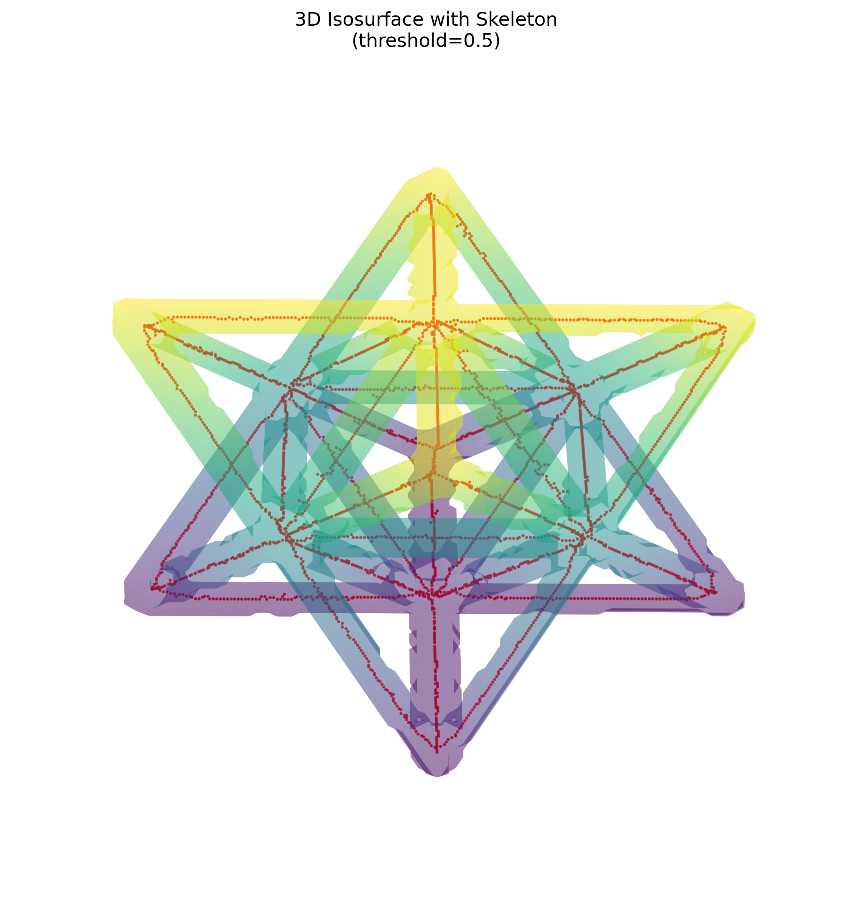
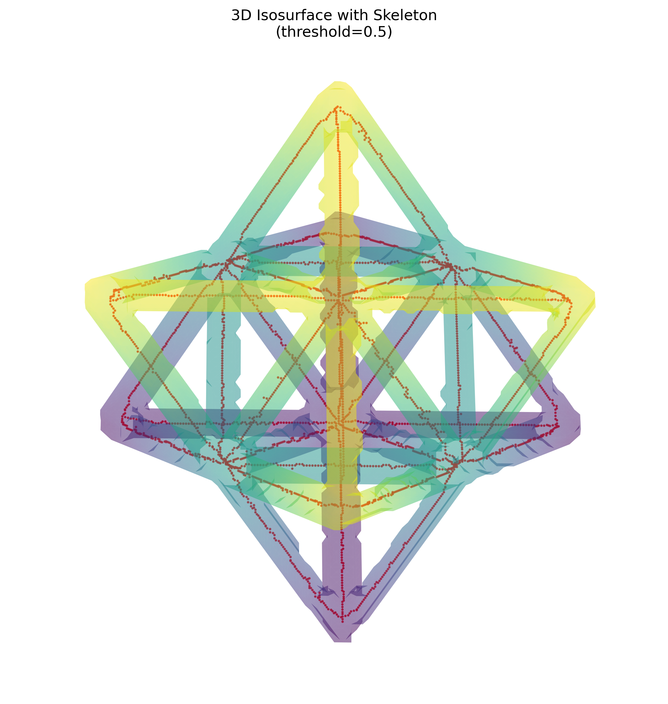

# Non-Destructive Evaluation Report

## Inputs

- Volume: `data\unitcell\unitcell.npy`
- Mask: `output\part1\unitcell_mask.npy`
- Skeleton: `output\part1\unitcell_skeleton.npy`

## Summary

| Metric | Value |
| --- | ---: |
| Volume shape | `(256, 256, 256)` |
| Raw mean intensity | 0.000539067 |
| Foreground voxel count | 717852 |
| Foreground fraction | 4.2787% |
| Skeleton voxel count | 3182 |
| Skeleton connected components | 1 |

## Visual gallery

### View A - elevation 30, azimuth 45

### View B - elevation 60, azimuth 45

## Interpretation

The mask and skeleton have identical volume dimensions. The foreground fraction quantifies mask-to-volume coverage; skeleton voxels and connected components provide a compact connectivity proxy. Review both rendered views before treating a component count as a defect finding, because segmentation thresholding can split or merge struts.
