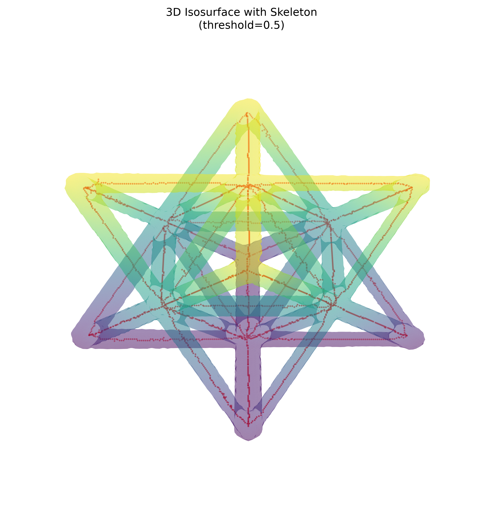
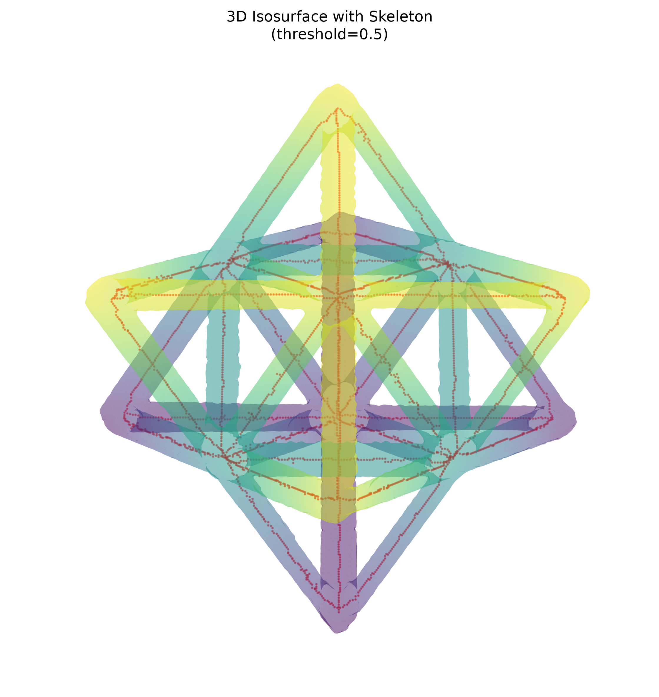

# Non-Destructive Evaluation Report: Unit Cell

## Scope

This report evaluates the `data/unitcell` CT dataset using the raw intensity volume (`unitcell.npy`), the supplied material mask (`segmentation.npy`), and the supplied centerline skeleton (`skeleton.npy`). The three arrays were checked for compatibility and all have dimensions **256 x 256 x 256** voxels.

## Summary Table

| Source | Measurement | Result |
| --- | --- | ---: |
| Volume | Array size | 256 x 256 x 256 voxels |
| Volume | Total voxels | 16,777,216 |
| Volume | Mean intensity | 0.000539 |
| Volume | Intensity standard deviation | 0.002418 |
| Volume | Intensity range | -0.003129 to 0.015258 |
| Mask | Foreground/material voxels | 721,774 |
| Mask | Material volume fraction | 4.3021% |
| Mask | Mean intensity within material | 0.011661 |
| Mask | Intensity standard deviation within material | 0.001482 |
| Mask | Mean background intensity | 0.000039 |
| Mask | 26-connected components | 1 |
| Skeleton | Skeleton voxels / length proxy | 3,173 |
| Skeleton | 26-connected components | 1 |
| Skeleton | Endpoint voxels | 47 |
| Skeleton | Branch / junction voxels, degree >= 3 | 168 |
| Skeleton | Isolated skeleton voxels | 0 |
| Alignment | Skeleton voxels inside mask | 3,173 of 3,173 (100.00%) |
| Alignment | Skeleton voxels outside mask | 0 |

Voxel counts are reported because no physical voxel spacing was supplied. Endpoint and branch counts are 26-neighborhood voxel-degree indicators, so they should be interpreted as morphological complexity proxies rather than a pruned graph-node inventory.

## Visual Gallery

The translucent isosurface is rendered from the normalized raw CT volume at threshold 0.5 after 2x downsampling. Red points overlay the supplied skeleton.

### View A: elevation 30 degrees, azimuth 45 degrees

### View B: elevation 60 degrees, azimuth 45 degrees

## Analysis

The mask identifies one connected material region occupying 4.30% of the reconstructed volume. Its mean intensity (0.011661) is much higher than the global mean (0.000539) and the background mean (0.000039), which is consistent with the segmentation selecting the high-density lattice struts from the surrounding background.

The skeleton is also a single connected structure. All 3,173 skeleton voxels are contained inside the material mask, and no skeleton voxels fall outside the segmented region. This indicates strong mask-to-skeleton alignment for the supplied files. The endpoint and branch-voxel counts reflect the unit cell boundaries and repeated octet-truss junction topology; they do not indicate disconnected material or skeleton fragments in this dataset.

## Files Analyzed

- `data/unitcell/unitcell.npy`
- `data/unitcell/segmentation.npy`
- `data/unitcell/skeleton.npy`

## Generated Figures

- `reports/nde_unitcell/view_a.png`
- `reports/nde_unitcell/view_b.png`
